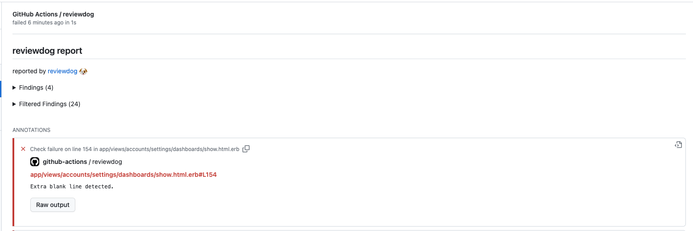
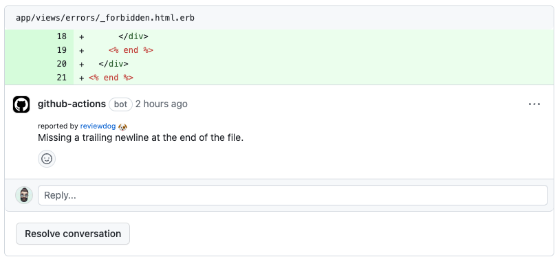

# GitHub Action: Run erb_lint with reviewdog 🐶

[](./LICENSE)
[](https://github.com/codeur/action-erblint/actions?query=workflow%3Areviewdog)
[](https://github.com/codeur/action-erblint/actions?query=workflow%3Adepup)
[](https://github.com/codeur/action-erblint/actions?query=workflow%3Arelease)
[](https://github.com/codeur/action-erblint/releases)
[](https://github.com/haya14busa/action-bumpr)

This action runs [erb_lint](https://github.com/Shopify/erb_lint) with
[reviewdog](https://github.com/reviewdog/reviewdog) on pull requests to improve
code review experience.

## Examples

### With `github-pr-check`

By default, with `reporter: github-pr-check` an annotation is added to the line:



### With `github-pr-review`

With `reporter: github-pr-review` a comment is added to the Pull Request Conversation:



## Inputs

### `github_token`

`GITHUB_TOKEN`. Default is `${{ github.token }}`.

### `erblint_flags`

Optional. erb_lint flags. (erb_lint --quiet --format tabs --no-exit-on-warn --no-exit-on-error `<erblint_flags>`)

### `erblint_version`

Optional. Set erb_lint version. Possible values:
- empty or omit: install latest version
- `gemfile`: install version from Gemfile (`Gemfile.lock` should be presented, otherwise it will fallback to latest bundler version)
- version (e.g. `0.9.0`): install said version

### `tool_name`

Optional. Tool name to use for reviewdog reporter. Useful when running multiple
actions with different config.

### `level`

Optional. Report level for reviewdog [`info`, `warning`, `error`].
It's same as `-level` flag of reviewdog.

### `reporter`

Optional. Reporter of reviewdog command [`github-pr-check`, `github-pr-review`].
The default is `github-pr-check`.

### `fail_level`

Optional. If set to `none`, always use exit code 0 for reviewdog. Otherwise, exit code 1 for reviewdog if it finds at least 1 issue with severity greater than or equal to the given level.
Possible values: [`none`, `any`, `info`, `warning`, `error`].
Default is `none`.

### `fail_on_error`

Optional. Deprecated, use `fail_level` instead. Exit code for reviewdog when errors are found [`true`, `false`].
Default is `false`.

### `filter_mode`

Optional. Filtering mode for the reviewdog command [`added`, `diff_context`, `file`, `nofilter`].
Default is `added`.

### `reviewdog_flags`

Optional. Additional reviewdog flags.

### `skip_install`

Optional. Do not install erb_lint. Default: `false`.

### `use_bundler`

Optional. Run erb_lint with bundle exec. Default: `false`.

### `workdir`

Optional. The directory from which to look for and run erb_lint. Default `.`.

## Example usage

```yaml
name: reviewdog
on: [pull_request]
jobs:
  erb_lint:
    name: runner / erb_lint
    runs-on: ubuntu-latest
    steps:
      - name: Check out code
        uses: actions/checkout@v6
      - name: Set up Ruby
        uses: ruby/setup-ruby@v1
        with:
          ruby-version: 3.4
      - name: erb_lint
        uses: codeur/action-erblint@v2
        with:
          erblint_version: gemfile
          reporter: github-pr-review
```

## Dev

### Release new version

1. Create a Pull Request with changes.
2. Add one of the following labels to the PR:
   - `bump:major`: Bump major version (e.g. v1.0.0 -> v2.0.0)
   - `bump:minor`: Bump minor version (e.g. v1.0.0 -> v1.1.0)
   - `bump:patch`: Bump patch version (e.g. v1.0.0 -> v1.0.1)
3. Merge the PR.
4. The release workflow will automatically bump the version, create a release, and update major/minor tags (e.g. v1).

## License

[MIT](https://choosealicense.com/licenses/mit)
